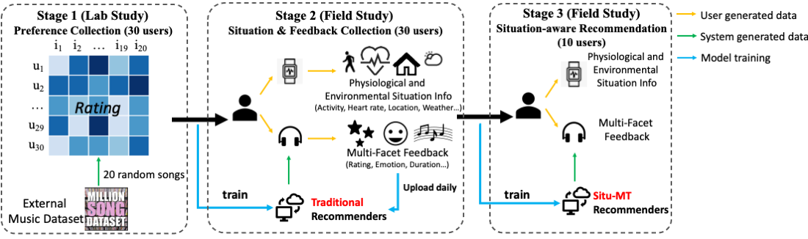
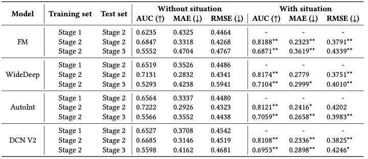

# SiTunes_dataset
This repository is the open source for *SiTunes*,  a situational music recommendation feedback dataset with Physiological and Psychological signals.

## Dataset Introduction
*SiTunes* is a music recommendation dataset that contains rich physiological situation information and psychological feedback signals based on a real-world user study. Data and explanations about the dataset are detailed in ``SiTunes\``.

### Collection Process
*SiTunes* is collected with a three-stage user study, which includes a lab study to collect users’ inherent preference (Stage 1), and two field studies to record situations, preference, and psychological feedback in users’ daily life with traditional recommenders (Stage 2) and situational recommenders (Stage 3).
An illustration of the data collection process is shown below.

### Basic Statistics

|         | #User | #Item | #Interaction | Phy. Signals | Psy. Signals | Rating | Psy. Feedback |
|---------|-------|-------|--------------|:------------:|:------------:|:------:|:-------------:|
| Stage 1 | 30    | 25    | 600          |              |       √      |    √   |       √       |
| Stage 2 | 30    | 105   | 897          |       √      |       √      |    √   |       √       |
| Stage 3 | 10    | 217   | 509          |       √      |       √      |    √   |       √       |
| All     | 30    | 307   | 2,006        |       √      |       √      |    √   |       √       |

## Experiments
We propose two tasks and corresponding baseline results on *SiTunes*: Situational music recommendation and psychological satisfaction as recommendation feedback in the resource paper.
Details about code, configs and settings of the experiments are shown in ``Experiments\``.

### Situational music recommendation
Integrating physiological and environmental situations, such as weather and activities, enables the design of recommenders that adapt to users' preference shifts in situations. 
For instance, a recommender system can suggest different music when the user is exercising on a sunny day or relaxing at home during a rainstorm.
Here we conducted preliminary experiments with *SiTunes* to explore how it can help with situational music recommendation.

We hypothesize that incorporating information about the user's situation could lead to better recommendations. 
To test this hypothesis, we designed a series of experiments using the three-stage dataset, which is partitioned as follows:

1. Setting 1: Stage 1 is used for training, and Stage 2 is used for testing. 
    This serves to predict situational preferences based on inherent preferences to explore the relation and differences between two types of preferences. 
    
2. Setting 2: Stage 2 data is used for both training and testing. It is conducted with and without situational information to compare the impact of situational information on predicting preferences. 
    
3. Setting 3: Stage 2 data is used for training, and Stage 3 data is used for testing. It is conducted both with and without situational information. This setting helps us examine potential connections and distribution differences of interactions generated by traditional and situational recommenders.
   
We evaluate the effectiveness of incorporating situational information into recommender systems using three evaluation metrics: AUC for assessing model discrimination ability regardless of class imbalance, MAE for easy interpretability and identifying large discrepancies, and RMSE for sensitivity to extreme errors. 

In our study, we chose to evaluate a set of models, 
including Factorization Machines (FM), Wide\&Deep,  AutoInt, and Deep \& Cross Network Version 2 (DCN V2).
Wide\&Deep and FM are selected as they represent classical and popular baseline approaches in the contextual recommendation.
And AutoInt and DCN V2 represent recent advances by which we aim to assess the possibility of employing state-of-the-art approaches on.
In experiments, we adopted the popular RecBole framework to implement and evaluate all results.

The results of the experiments are shown below 

The experimental results presented in the table offer compelling evidence for the importance of situational information in recommender systems. Comparing with recommendation results without situation, significant performance improvements are achieved for almost all metrics for all models when situational data is incorporated. Therefore, the situational information provided in *SiTunes* is significantly helpful for music recommendation tasks.

The observed improvement in AUC, MAE, and RMSE metrics when situational data is used highlights the significance of this information in enhancing the accuracy of rating predictions.

Comparing results in three settings,
the superior performance of models in Setting 2 to Setting 1 illustrates the necessity of real-world data to better understand the impact of situational factors on user preferences, which confirms the need to involve a field study. 
Performance in Setting 3 is also worse than in Setting 2.
The performance decrease may be caused by the distribution discrepancy between Stage 2 and Stage 3 with different backbone recommenders. 
Nevertheless, it worth noting that they are not so comparable as the test sets are distinct.

Furthermore, we observe no significant performance difference between the four models. 
The limited scale of our dataset may cause AutoInt and DCN V2 to not have outstanding performances compared with traditional models.
However, these methods are all used for general context-aware recommendation, and we believe models designed explicitly for situational recommendation will lead to better performance in the future,
suggesting that our dataset might not be sufficiently large to exploit the capabilities of advanced machine learning methods fully. 
We believe that a larger dataset with rich context and situational information could better support these methods and yield more insightful results.

### Psychological Satisfaction as Recommendation Feedback

As music can convey emotions and change emotions of listeners, music recommendation should pay attention to psychological satisfaction besides preference matching.
The analysis in the Figure indicates that emotions and emotion changes are closely related to but also different from users' rating preference.
Therefore, psychological satisfaction should be taken as a stand-alone measure for music recommendation.
With our dataset, Situ-Music, we take a first step to achieve users' psychological satisfaction in music by an example verification task, emotion change prediction.

Prediction results of all three situation combinations in two settings are shown in the table below.
The relative t-test is conducted between adjacent situations of the same model, i.e., Obj. $v.s.$ Sub. and Sub. $v.s.$ Obj.+Sub.
*/** indicates p-value<0.05/0.01, and the best results are shown in \textbf{bold}.

Comparing results with different kinds of situation features, we find that Obj. situation helps predict mood changes after music listening, as the results are better than random predictions.
Classification results with Sub. situations are significantly better than objective ones, which confirms the close relationship between users' emotion before and after music listening, and shows the importance of collecting psychological signals.
Finally, Obj. + Sub. situation features achieve the best results on Stage 2, but not Stage 3.
The reason might be that the models are trained on Stage 2 data, and Obj. features are effective indicators for datasets with the same distribution as training set, but not as effective as Sub. features for out-of-distribution inference.
