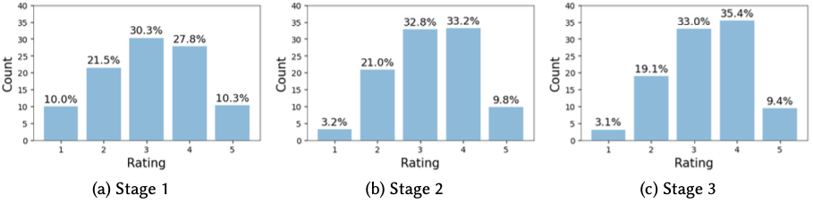
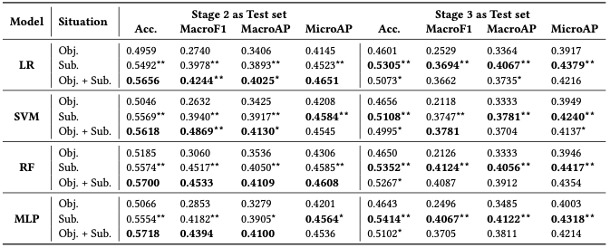

# SiTunes_dataset
This repository is the open source for *SiTunes*,  a situational music recommendation feedback dataset with Physiological and Psychological signals.

## Dataset Introduction
*SiTunes* is a music recommendation dataset that contains rich physiological situation information and psychological feedback signals based on a real-world user study. Data and explanations about the dataset are detailed in [`SiTunes\`](/SiTunes/).

### Collection Process
*SiTunes* is collected with a three-stage user study, which includes a lab study to collect users’ inherent preference (Stage 1), and two field studies to record situations, preference, and psychological feedback in users’ daily life with traditional recommenders (Stage 2) and situational recommenders (Stage 3).
An illustration of the data collection process is shown below.

### Basic Statistics

|         | #User | #Item | #Interaction | Phy. Signals | Psy. Signals | Env. Data | Rating | Psy. Feedback |
|---------|-------|-------|--------------|:------------:|:------------:|:---------:|:------:|:-------------:|
| Stage 1 | 30    | 25    | 600          |              |              |           |   √    |       √       |
| Stage 2 | 30    | 105   | 897          |       √      |       √      |     √     |   √    |       √       |
| Stage 3 | 10    | 217   | 509          |       √      |       √      |     √     |   √    |       √       |
| All     | 30    | 307   | 2,006        |       √      |       √      |     √     |   √    |       √       |

- **Phy. Signals:** Includes physiological signals such as heart rate*, activity intensity, activity step, and activity type.
- **Psy. Signals:** Refers to emotions recorded before music listening, measured in two dimensions (valence/arousal).
- **Env. Data:** Environmental data including time of day, weather information (type, pressure, temperature, humidity), and location details (longitude*, latitude*, speed).
- **Rating:** User ratings based on a five-point Likert scale.
- **Psy. Feedback:** Emotional response after music listening, also measured in valence and arousal.

\* The heart rate data was normalized for each user, longitude and latitude values were re-scaled to protect user privacy.

Rating distributions throughout three stages of the study:

Distributions of emotional valence and arousal throughout three stages of user study:

Distributions of weather, activity type and time of day in Stage 2 and Stage 3: 

## Experiments
We propose two tasks and corresponding baseline results on *SiTunes*: Situational music recommendation and psychological satisfaction as recommendation feedback in the resource paper.
Details about code, configs and settings of the experiments are shown in [`Experiments\`](/Experiments/).

### Situational music recommendation
Integrating physiological and environmental situations, such as weather and activities, enables the design of recommenders that adapt to users' preference shifts in situations. 
For instance, a recommender system can suggest different music when the user is exercising on a sunny day or relaxing at home during a rainstorm.
Here we conducted preliminary experiments with *SiTunes* to explore how it can help with situational music recommendation.

We hypothesize that incorporating information about the user's situation could lead to better recommendations. 
To test this hypothesis, we designed a series of experiments using the three-stage dataset, which is partitioned as follows:

1. Setting 1: Stage 1 is used for training, and Stage 2 is used for testing. 
    This serves to predict situational preferences based on inherent preferences to explore the relation and differences between two types of preferences. 
    
2. Setting 2: Stage 2 data is used for both training and testing. It is conducted with and without situational information to compare the impact of situational information on predicting preferences. 
    
3. Setting 3: Stage 2 data is used for training, and Stage 3 data is used for testing. It is conducted both with and without situational information. This setting helps us examine potential connections and distribution differences of interactions generated by traditional and situational recommenders.
   
The results of the experiments are shown below.

Relative t-test is conducted between situations for the same model with \*/*\* for p-value<0.05/0.01.

The experimental results presented in the table offer compelling evidence for the importance of situational information in recommender systems. The observed improvement in AUC, MAE, and RMSE metrics when situational data is used highlights the significance of this information in enhancing the accuracy of rating predictions. Significant performance improvements are achieved for almost all metrics for all models when situational data is incorporated. Therefore, the situational information provided in *SiTunes* is significantly helpful for music recommendation tasks.

Comparing results in three settings,
the superior performance of models in Setting 2 to Setting 1 illustrates the necessity of real-world data to better understand the impact of situational factors on user preferences, which confirms the need to involve a field study. 
Performance in Setting 3 is also worse than in Setting 2.
The performance decrease may be caused by the distribution discrepancy between Stage 2 and Stage 3 with different backbone recommenders. 
Nevertheless, it worth noting that they are not so comparable as the test sets are distinct.

More details about the experiment settings and result analysis are shown in [`Experiments\Situational_recommendation\`](/Experiments/Situational_recommendation).

### Psychological Satisfaction as Recommendation Feedback

As music can convey emotions and change emotions of listeners, music recommendation should pay attention to psychological satisfaction besides preference matching.
Given user ID, music metadata, and situations, we aim to predict if users' emotions will lift, drop or keep after music listening.

Three different feature combinations are applied as the situation information during the experiments. 
1. The first is Objective (Obj.), which utilizes all objective information as situation features, including time, weather, location, and physiological features collected. The features and pre-process strategies are the same as in the referenced subsection.

2. The second is Subjective (Sub.), including users' annotated valence and arousal values before listening to music. The subjective features might be helpful since emotions statistically tend to become neutral, i.e., it is unlikely to lift the emotion after listening to music when a user is already in high valence.

3. The third is to concatenate objective and subjective features as a whole, referred to as Obj.+Sub.

Prediction results of all three situation combinations in two settings are shown in the table below.

The relative t-test is conducted between adjacent situations of the same model, i.e., Obj. $v.s.$ Sub. and Sub. $v.s.$ Obj.+Sub.
\*/*\* indicates p-value<0.05/0.01, and the best results are shown in **bold**.

Comparing results with different kinds of situation features, we find that Obj. situation helps predict mood changes after music listening, as the results are better than random predictions.
Classification results with Sub. situations are significantly better than objective ones, which confirms the close relationship between users' emotion before and after music listening, and shows the importance of collecting psychological signals.
Finally, Obj. + Sub. situation features achieve the best results on Stage 2, but not Stage 3.
The reason might be that the models are trained on Stage 2 data, and Obj. features are effective indicators for datasets with the same distribution as training set, but not as effective as Sub. features for out-of-distribution inference.

More details about the experiment settings and result analysis are shown in [`Experiments\Psychological_satisfaction_prediction\`](/Experiments/Psychological_satisfaction_prediction).

## Challenges in dataset collection
